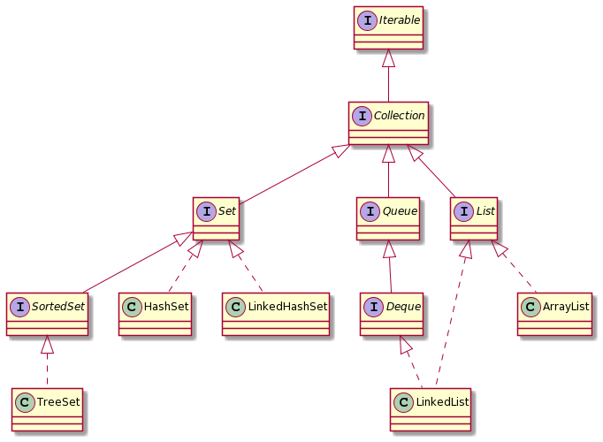
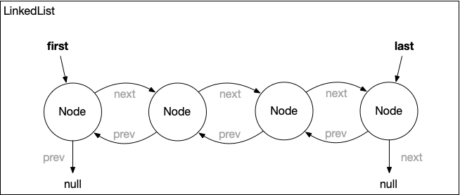
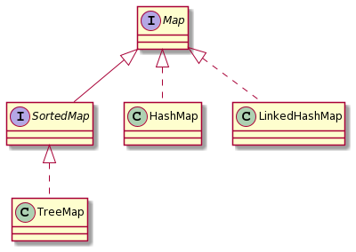

= Professionelle Softwareentwicklung: Woche 2 
:icons: font
:icon-set: fa
:source-highlighter: rouge
ifdef::env-github[]
:tip-caption: :bulb:
:note-caption: :information_source:
:important-caption: :heavy_exclamation_mark:
:caution-caption: :fire:
:warning-caption: :warning:
endif::[]
:experimental:

== Begrüßung und Organisatorisches 

Schauen Sie sich das https://youtu.be/6NvmHlsACGw[Begrüßungsvideo] an.

=== Deadlines

Am 22.04.2021 um 14:30 Uhr enden die Deadlines für die https://propraregister.mops.cs.hhu.de/[Registrierung] zum Praktikum und die https://pure.mops.cs.hhu.de/[Anmeldung für die erste praktische Übung] in der nächsten Woche. 

Ohne Registrierung können Sie keine Klausurzulassung erwerben. Ohne Anmeldung zur praktischen Übung können Sie nicht an der ersten praktischen Übung teilnehmen. 

=== Praktische Übung

Wenn Sie eine bestehende Zulassung haben, können Sie *nicht* an den praktischen Übungen teilnehmen, da die Plätze für Studierende gebraucht werden, die noch keine Zulassung haben. Sie bekommen aber das Material und können die praktischen Übungen selber absolvieren. Am besten organisieren Sie sich mit anderen Teilnehmer:innen, die bereits eine Zulassung haben. 

=== Termin Fragestunde

Uns wurde zugetragen, dass der Termin am Montag vielleicht etwas ungünstig gelegen ist. Bitte füllen Sie die folgende https://terminplaner4.dfn.de/5NVdpNhOpTLUea4r[Umfrage] aus, um eventuell einen besseren Termin zu finden. Tragen Sie als Namen ihren GitHub-Benutzernamen ein.

== Aufgabe 1: Java und die JVM

Schauen Sie sich das Video zum https://youtu.be/R4zfZCfHeM8[Java Ökosystem] an. 

*Leitfragen/Aufgaben:*

* Der Vorteil eines festen Release-Zyklus ist es, dass neue Features schneller auf den Markt gebracht werden können. Gibt es auch Nachteile? Wenn ja, welche?
+ 
TIP: Überlegen Sie einmal aus der Perspektive von Entwickler:innen, deren Feature zum Releasezeitpunkt erst halb fertig ist.

* Was ist die Aufgabe des JIT? Und warum ist der JIT für die Verbreitung von Java wichtig gewesen?

*Zusatzmaterial:*

* https://www.youtube.com/watch?v=BXFHuaQNnLo[JDK, JRE, JVM: What Are They and What Are Their Differences?]
* https://www.youtube.com/watch?v=Y9chepoB7QM[AdoptOpenJDK - was ist das eigentlich?] von Hendrik Ebbers
* https://youtu.be/e2zmmkc5xI0[Java Bytecode Crash Course] von David Buck
* https://youtu.be/ocUx-QUJMfo[Really Understanding Garbage Collection] von Gil Tene

== Aufgabe 2: Die Java Klassenbibliothek

Im Lieferumfang von Java sind in etwa https://docs.oracle.com/en/java/javase/11/docs/api/allclasses.html[4500 dokumentierte öffentliche Klassen] enthalten, die uns direkt zur Verfügung stehen. 

NOTE: Wir werden hier einmal alle Arten von Datentypen (also zum Beispiel auch Interfaces) unter dem Begriff `Klasse` zusammenfassen.   

Einige Klassen bilden das https://docs.oracle.com/en/java/javase/11/docs/api/java.base/java/lang/package-summary.html[Fundament] von Java. Diese Klassen liegen in dem Paket `java.lang`, welches automatisch von jeder Klasse importiert wird. Einen Teil dieser Klassen wie zum Beispiel Object, String, System, Math, usw. haben Sie sicherlich schon in der Veranstaltung Programmierung im ersten Semester kennengelernt. 

Die Klassenbibliothek stellt uns aber noch viele weitere Klassen bereit. Es gibt Klassen zur Handhabung von Zeit und Datum, von Dateien, Klassen um mit Nebenläufigkeit umzugehen, zur Erstellung von grafischen Oberflächen, zur Arbeit mit Datenbanken und vieles mehr. 

Wir wollen uns in dieser Woche auf das *Collections Framework* beschränken, das Datenstrukturen wie Listen, Mengen und Maps bereitstellt. 

In der Veranstaltung Programmierung haben Sie vermutlich ziemlich viel mit Arrays gearbeitet. Der Grund dafür ist, dass Arrays fast ohne Vorwissen über Objekte eingeführt werden können. In der Praxis spielt die direkte Verwendung von Arrays aber eher eine untergeordnete Rolle, da sie durch ihre feste Größe im Umgang etwas unbequem sind.  

In Java sind die wesentlichen dynamischen Datenstrukturen, wie Listen, Maps und Mengen, bereits vorhanden und es gibt externe Bibliotheken für fast alle weiteren Datenstrukturen. 

IMPORTANT: *Schreiben Sie keine generischen Datenstrukturen wie Listen, Mengen, Maps, etc. selber!*

Für allgemeine Fälle gibt es mit hoher Wahrscheinlichkeit schon Implementierungen. Wenn Sie bei den Standard-Collections, die Java mitbringt, nicht fündig werden, schauen Sie zum Beispiel bei https://github.com/google/guava/wiki[Google Guava] oder https://commons.apache.org/proper/commons-collections/[Apache Commons Collections] nach. 

NOTE: Es ist natürlich eine interessante intellektuelle Herausforderung, Datenstrukturen selber zu schreiben und sich anzuschauen, wie die Bibliotheken Datenstrukturen umgesetzt haben. 

=== Collection

Wir schauen uns nun einen kleinen Ausschnitt von häufig verwendeten Datenstrukturen an. Das folgende Bild ist ein UML Klassendiagramm. Interfaces sind mit `I`, Klassen mit `C` gekennzeichnet. Ein gestrichelter Pfeil ist eine Implementierungsbeziehung, beispielsweise implementiert (implements) die Klasse `LinkedList` sowohl das Interface `List`, als auch das Interface `Deque`. Ein durchgezogener Pfeil ist eine Erweiterungsbeziehung, beispielsweise erweitert (extends) das Interface `SortedSet` das Interface `Set`. Eine Erweiterungsbeziehung könnten wir auch zwischen Klassen haben, in diesem Diagramm sind allerdings keine solchen Beziehungen vorhanden. 

Das Basis-Interface ist `Collection`. Dort sind Methoden definiert, die für alle sequenzartigen Kollektionen sinnvoll sind. 

* `add` und `addAll`, um Elemente in die Kollektion einzufügen
* `remove`, `removeAll`, `removeIf`, `retainAll` und `clear`, um Elemente zu löschen
* `contains` und `containsAll`, um herauszufinden, ob Elemente in der Kollektion vorhanden sind
* `size` und `isEmpty`, um die Anzahl der Elemente abzufragen, bzw. herauszufinden, ob Kollektion leer ist
* `toArray` und `stream` um die Kollektion in ein Array bzw. einen Stream zu konvertieren 

Konkrete Klassen implementieren üblicherweise eines der drei spezifischeren Interfaces `List`, `Set` und `Queue`, die wir uns im Folgenden anschauen wollen. 

=== List 

Das `List` Interface ist für Kollektionen gedacht, bei denen die Elemente geordnet positioniert sind. Das bedeutet nicht, dass sie sortiert sind, sondern dass sie eine bestimmte Position in der Kollektion haben. Dasselbe Element kann auch mehrfach in einer Liste vorkommen. 

Die wesentlichen Methoden, die `List` zusätzlich spezifiziert, sind 

* `get` um ein Element, das an einer bestimmten Position in der Liste gespeichert ist, zu lesen
* `set` um ein Element, das an einer bestimmten Position in der Liste gespeichert ist, zu überschreiben

Außerdem stellt `List` eine zusätzliche Variante von `add` bereit, mit der ein Element an einer spezifischen Stelle eingefügt werden kann. Alle Elemente, die einen größeren Index als die Einfügestelle haben, werden um eine Position verschoben.

[source, java]
----
List<Integer> ints = init(); // Eine Liste mit irgendwelchen Werten erzeugen 
ints.add(1, 6); // füge an Position 1 den Wert 6 ein
----

Seit Java 9 gibt es in `List` (und auch in `Set`) eine statische Methode `of`, mit der wir Listen direkt erzeugen können. Eine solche Methode wird als statische Factorymethode bezeichnet. Listen, die wir mit `of` erzeugen, können nach der Erzeugung nicht mehr geändert werden. 

[source, java]
----
List<Integer> numbers = List.of(2,3,4,5,6,7,8,9,16);
System.out.println(numbers); // => [2, 3, 4, 5, 6, 7, 8, 9, 16]
numbers.add(23); // => Exception java.lang.UnsupportedOperationException
----

Schauen wir uns nun zwei Implementierungen von `List` an.

*ArrayList*

Die `ArrayList` ist die wahrscheinlich am häufigsten verwendete sequenzartige dynamische Datenstruktur. Eine `ArrayList` verwendet intern ein Array zur Datenspeicherung. Es ist folglich sehr effizient auf beliebige Elemente per Index zuzugreifen. Einfügen an einer beliebigen Stelle ist dagegen teuer, da alle Elemente an den Folgepositionen verschoben werden müssen.

Wenn das interne Array voll ist, wird ein neues Array mit mindestens 50% größerer Kapazität erzeugt und das alte Array umkopiert.

NOTE: Seitenbemerkung: Der Grund dafür, dass das Array immer, wenn es voll wird, um einen Faktor vergrößert wird, bewirkt, dass die sogenannte amortisierte Laufzeit für das Einfügen konstant ist, obwohl das Array gelegentlich umkopiert werden muss. Amortisierte Laufzeitanalyse werden Sie in der Vorlesung Algorithmen und Datenstrukturen kennenlernen. 

Schauen wir uns einmal die Verwendung von `ArrayList` an einem Beispiel an. Sie können den Code in eine Klasse in die `main` Methode kopieren, oder in der JShell ausführen.

[source, java]
----
List<String> names = new ArrayList<>();
// Beobachtung 1: Der Typ der Variablen kann eine Superklasse vom erzeugten Typ sein oder ein Interface, dass die Klasse implementiert (das kennen Sie schon vom Flying Objects Beispiel aus Programmierung)
// Beobachtung 2: Die Collection Klassen sind parametrisiert, hier mit String. Das kennen Sie auch schon aus Programmierung. 
// Beobachtung 3: Sie müssen den Typ-Parameter bei der Instanziierung seit Java 7 nicht wiederholen.  

System.out.println(names); // => []

// Ein erstes Element wird eingefügt, Rückgabe ist true, wenn es erfolgreich war
System.out.println(names.add("Java Mc Javaface")); // => true 

names.add("James Gossling"); // => true

// ArrayList zählt intern mit, der Aufruf ist billig!
System.out.println(names.size()); // => 2

System.out.println(names); // => [Java Mc Javaface, James Gossling]

// Einfügen in der Mitte. Das kann teuer werden!
names.add(1, "Brian Goetz");

System.out.println(names); // => [Java Mc Javaface, Brian Goetz, James Gossling]

// Beim Überschreiben bekommen wir den überschriebenen Wert zurück
System.out.println(names.set(0, "Joshua Bloch")); // => "Java Mc Javaface"

System.out.println(names); // => [Joshua Bloch, Brian Goetz, James Gossling]

ArrayList<String> javaleute = new ArrayList<>();

// Alle Elemente einer Liste in eine andere einfügen
System.out.println(javaleute.addAll(names)); // => true

// Alle Elemente entfernen 
names.clear()

System.out.println(names); // => []
System.out.println(javaleute); // => [Joshua Bloch, Brian Goetz, James Gossling]
----

*LinkedList*

Die zweite Implementierung, die wir anschauen, ist die `LinkedList`. Die `LinkedList` in Java ist keine einfach verkettete Liste, wie Sie sie in der Vorlesung Programmierung kennengelernt haben, sondern eine doppelt verkettete Liste. Jeder Knoten in der Liste hat eine Referenz auf den Nachfolger *und* den Vorgänger. 

Das hat den Vorteil, dass wir sowohl hinten, als auch vorne effizient (also in konstanter Zeit) Elemente einfügen und entfernen können. Wenn wir auf ein Element in der Mitte zugreifen wollen, müssen wir erst vom Anfang oder vom Ende zu der Stelle "laufen", d.h. der Zeigerkette folgen. Als Liste spielt die `LinkedList` aus diesem Grund eine eher untergeordnete Rolle. Für die meisten Zwecke ist die `ArrayList` eine bessere Wahl.

Da sowohl am Anfang, also auch am Ende effizient eingefügt und gelöscht werden kann, bietet sich die `LinkedList` als Implementierung für das `Queue` und `Deque` (für Double Ended Queue) Interface an. 

Tatsächlich wird die `LinkedList` selten als Liste und häufig als Implementierung eines Stacks oder Queue verwendet. 

=== Queue

Das `Queue` Interface spezifiziert Methoden, die wir bei einer Queue Implementierung erwarten. Das Einfügen in eine Queue mit `offer`, das "anschauen" des nächsten Elements ohne es zu entfernen mit `peek` und das Entfernen des nächsten Elements mit `poll`. Bei der FIFO (First In, First Out) Queue, die Sie vielleicht kennengelernt haben, werden Elemente hinten in der Queue eingereiht und vorne entfernt. `LinkedList` ist eine Implementierung einer solchen FIFO Queue. 

[source, java]
----
Queue<String> q = new LinkedList<>();

q.offer("a");
q.offer("b");
q.offer("c");

System.out.println(q); // => [a, b, c]
System.out.println(q.peek()); // => a
System.out.println(q); // => [a, b, c]
System.out.println(q.poll()); // => a
System.out.println(q); // => [b, c]
----

Die `LinkedList` Klasse implementiert aber nicht nur das `Queue` Interface, sondern auch das `Deque` Interface, dass uns Zugriff auf beide Seiten ermöglicht. In `Deque` sind Varianten der `Queue` Methoden wie `offerFirst` und `offerLast` (analog für die anderen Methoden) definiert. Außerdem hat `Deque` Methoden, die wir bei einem Stack erwarten: `push` um ein Element auf den Stack zu legen und `pop` um das Element vom Stack herunterzuholen. Stacks haben ein LIFO (last in, first out) Verhalten. 

[source, java]
----
Deque<String> stack = new LinkedList<>();

stack.push("x");
stack.push("y");
stack.push("z");

System.out.println(stack); // => [z, y, x]
System.out.println(stack.peek()); // => z
System.out.println(stack); // => [z, y, x]
System.out.println(stack.pop()); // => z
System.out.println(stack); // => [y, x]
----

NOTE: Die Implementierungen der Methoden sind zum Teil identisch. Die `pop` Methode ruft zum Beispiel die `removeFirst` auf. Der Grund dafür ist, dass wir die uns bekannten Namen für Stack bzw. Queue Operationen direkt verwenden können. 

=== Set

Ein Set entspricht in etwa einer Menge in der Mathematik, bei der Elemente höchstens einmal vorkommen. Eine der häufig verwendeten Implementierungen ist das `HashSet`.

[source, java]
----
Set<Integer> ints = new HashSet<>();
ints.addAll(List.of(3,4,5,6,7,8,9,16));
System.out.println(ints); // =>  [16, 3, 4, 5, 6, 7, 8, 9]
----

Bei einer Klasse, die nur `Set`, aber nicht `SortedSet` implementiert, gibt es keine Garantien, in welcher Reihenfolge die Elemente durchlaufen werden. Die Reihenfolge dürfte sich im Prinzip auch von Lauf zu Lauf unterscheiden. Es sollten auf gar keinen Fall irgendwelche Annahmen darüber gemacht werden. 

Wenn wir eine bestimmte Reihenfolge benötigen, sollten wir eine Klasse verwenden, die `SortedSet` implementiert. Hier kann entweder eine Instanz des `Comparator` Interfaces benutzt werden, oder die natürliche Reihenfolge. Die natürliche Reihenfolge ist für alle Datentypen definiert, die das `Comparable` Interface implementieren, wie zum Beispiel Integer oder String. Eine Klasse, die `SortedSet` implementiert ist `TreeSet`.

[source, java]
----
Set<Integer> ints = new TreeSet<>(); 
ints.addAll(List.of(7,6,4,9,3,8,16,5));
System.out.println(ints); // =>  [3, 4, 5, 6, 7, 8, 9, 16]
----

Probieren wir auch einmal eine Version aus, die nicht die natürliche Reihenfolge verwendet, sondern die geraden Zahlen zuerst ausgibt. Dazu benötigen wir einen `Comparator`.

[source, java]
----
Comparator<Integer> evenFirstComparator = new Comparator<Integer>() {
  @Override
  public int compare(Integer o1, Integer o2) {
    if (o1 % 2 == o2 % 2) {  
      return o1.compareTo(o2); 
    }
    if (o1 % 2 == 0) return -1;
    else return 1;
  };
};

SortedSet<Integer> set = new TreeSet<>(evenFirstComparator);
set.addAll(List.of(3,4,5,6,7,8,9,16));
System.out.println(set); // => [4, 6, 8, 16, 3, 5, 7, 9]
set.add(10);
System.out.println(set); // => [4, 6, 8, 10, 16, 3, 5, 7, 9]
set.add(13);
System.out.println(set); // => [4, 6, 8, 10, 16, 3, 5, 7, 9, 13]
----

Ein `Comparator` implementiert eine Funktion `compareTo`, die zwei Instanzen `a` und `b` des zu vergleichenden Objekts übergeben bekommt. Die Methode gibt einen negativen Wert zurück, wenn `a` bezüglich unserer Sortierung kleiner ist als `b`, einen positiven Wert, wenn `a` größer ist als `b` und 0, falls beide Werte gleich sind. 

NOTE: Weiter unten im Abschnitt über Schleifen werden Sie den Begriff funktionales Interface kennenlernen. `Comparator` ist ein solches funktionales Interface. 

=== Map

Die Klassen, die das `Map` Interface unterstützen, erben nicht von `Collection`, werden aber auch zur Speicherung von Daten verwendet. Es werden aber keine einzelnen Elemente gespeichert, sondern Schlüssel-Wert Paare. In anderen Sprachen werden solche Strukturen auch als Dictionary oder assoziative Arrays/Container bezeichnet. In der Veranstaltung Programmierung haben Sie Maps als Symbol Table kennengelernt. 

Ähnlich wie Sets gibt es Maps in zwei Varianten: unsortierte und sortierte Maps. Die Sortierung bezieht sich dabei auf die Schlüssel. 

Das `Map` Interface hat ähnliche Methoden wie das `Collection` Interface.

* `get` und `getOrDefault`, um Werte nachzuschlagen

* `put`, `putAll` und `putIfAbsent`, um Schlüssel-Wert-Paare in die Map einzufügen

* `remove` und `clear`, um Paare zu löschen

* `keySet`, `values` und `entrySet` um eine Kollektion der Schlüssel, Werte oder Schlüssel-Wert-Paare zu bekommen 

Es gibt auch wie bei `List` und `Set` eine statische Factorymethode `of`, um unveränderliche Maps zu erzeugen.

Wir schauen uns hier die Klasse `HashMap` an, weil diese in den meisten Fällen gut geeignet ist. Die `HashMap` garantiert keine bestimmte Reihenfolge, wenn die Werte ausgegeben werden. Wenn wir die Einfügereihenfolge beibehalten wollen, können wir die Klasse `LinkedHashMap` verwenden. Es gibt auch analog zu den Sets das Interface `SortedMap`, bei dem die Schlüssel in sortierter Reihenfolge vorliegen.

[source, java]
----
import java.util.HashMap;
import java.util.LinkedHashMap;
import java.util.Map;
import java.util.TreeMap;

class Customer {

  private final String name;

  private Customer(String name) {
    this.name = name;
  }

  public String toString() {
    return name;
  }

  public static Customer customer(String name) {
    return new Customer(name);
  }

  public static void main(String[] args) {
    Map<Integer, Customer> customers = new HashMap<>();

    customers.put(1, customer("Bill Gates"));
    customers.put(3, customer("Jeff Bezos"));
    customers.put(2, customer("Elon Musk"));

    System.out.println(customers); // => {1=Bill Gates, 2=Elon Musk, 3=Jeff Bezos}

    System.out.println(customers.get(2)); // => Elon Musk
    System.out.println(customers.get(4)); // => null

    System.out.println(customers.getOrDefault(2, customer("Arno Nym"))); // => Elon Musk
    System.out.println(customers.getOrDefault(4, customer("Arno Nym"))); // => Arno Nym

    customers.putIfAbsent(3, customer("Karl Albrecht"));
    System.out.println(customers.values()); // => [Bill Gates, Elon Musk, Jeff Bezos]

    customers.put(3, customer("Karl Albrecht")); // => [Bill Gates, Elon Musk, Karl Albrecht]
    System.out.println(customers.values());

    customers.remove(2);
    System.out.println(customers); // => {1=Bill Gates, 3=Karl Albrecht}

    customers.put(16, customer("Warren Buffett "));
    System.out.println(customers); // => {16=Warren Buffett , 1=Bill Gates, 3=Karl Albrecht}
  }
}
----

=== Utility Klassen 

Es lohnt sich auch einen Blick auf zwei Hilfsklassen `Collections` und `Arrays` zu werfen. Dort finden sich eine ganze Reihe von sehr nützlichen Hilfsmethoden. 

[source, java]
----
List<String> liste = new ArrayList<>(List.of("Kartoffeln", "Tomaten", "Wasser", "Brot"));
System.out.println(liste); // => [Kartoffeln, Tomaten, Wasser, Brot]

Collections.reverse(liste); // Achtung die Originalliste wird verändert!
System.out.println(liste); // => [Brot, Wasser, Tomaten, Kartoffeln]

Collections.sort(liste); 
System.out.println(liste); // => [Brot, Kartoffeln, Tomaten, Wasser]

Collections.swap(liste, 0, 2);
System.out.println(liste); // => [Tomaten, Kartoffeln, Brot, Wasser]

Collections.shuffle(liste);
System.out.println(liste); // => Die Liste in zufälliger Reihenfolge

Collections.sort(liste); 
Collections.rotate(liste, 1);
System.out.println(liste); // => [Wasser, Brot, Kartoffeln, Tomaten]

Collections.rotate(liste, -2);
System.out.println(liste); // => [Kartoffeln, Tomaten, Wasser, Brot]

Collections.fill(liste, "Bier");
System.out.println(liste); //=> [Bier, Bier, Bier, Bier]
----

=== Externe Bibliotheken 

Stellen wir uns vor, wir wollen praktische Übungsgruppen verwalten und benötigen eine Datenstruktur, um Studierende auf Termine aufzuteilen. Wir können dazu eine Map verwenden, deren Schlüssel die Termine sind und jedem Termin ein Set von Studierenden zuordnen. Vor Java 8 war der notwendige Code ziemlich unangenehm. Wir müssen das zu einem Termin gehörende Set aus dem Map holen. Wenn das Set noch nicht existiert, müssen wir ein neues Set anlegen und können dann das GitHub Handle speichern. 

[source, java]
----
public class AwkwardMap {

  private final HashMap<String, Set<String>> zuordnung = new HashMap<>();

  public void add(String termin, String githubHandle) {
    Set<String> handles = zuordnung.get(termin);
    if (handles == null) {
      handles = new HashSet<>();
    }
    handles.add(githubHandle);
  }
}
----

In Java 8 können wir `getOrDefault` verwenden, um den Code viel kompakter aufzuschreiben.  

[source, java]
----
public class AwkwardMap {

  private final HashMap<String, Set<String>> zuordnung = new HashMap<>();

  public void add(String termin, String githubHandle) {
    Set<String> handles = zuordnung.getOrDefault(termin, new HashSet<>());
    handles.add(githubHandle);
  }
}
----

Der Code ist viel schöner, leider haben beide Versionen einen Bug und funktionieren nicht. 

Besser wäre hier gewesen eine Multi-Map Implementierung aus Google Guava oder Apache Commons Collection zu verwenden. Mit Apache Commons Collection könnten wir den Code so schreiben, als hätten wir eine normale Map und wir könnten sicher sein, dass wir keinen so groben Fehler machen. 

[source, java]
----
public class BetterMap {

  // Verwendet die Bibliothek Apache Commons Collection
  // Wie Sie so eine Bibliothek nutzen schauen wir uns in der kommenden Woche an
  private final HashSetValuedHashMap<String, String> zuordnung = new HashSetValuedHashMap<>();

  public void add(String termin, String githubHandle) {
    zuordnung.put(termin, githubHandle);
  }
}
----

*Leitfragen/Aufgaben:*

* Fassen Sie zusammen, welche konkreten Klassen für welche Zwecke verwendet werden. Suchen Sie für die Verwendung jeweils ein Beispiel. 

* Was macht die Methode `retainAll`? Angenommen wir verwenden zwei Mengen, welcher mathematischen Operation entspricht `retainAll`? Implementieren Sie ein Beispiel. 

* Im obigen Beispiel zu sortierten Mengen findet sich folgende Zeile
+
[source, java]
----
Set<Integer> ints = new TreeSet<>(); 
----
+
Muss das nicht `SortedSet` heißen? 

* Schauen Sie sich den `Comparator` aus dem Beispiel ganz genau an und gehen Sie alle möglichen Eingaben durch (zwei unterschiedliche gerade Zahlen, zwei unterschiedliche ungerade Zahlen, eine gerade und eine ungerade Zahl, eine ungerade und eine gerade Zahl, zweimal dieselbe Zahl) und schreiben Sie auf, welches Resultat Sie erhalten.

* Angenommen, wir wollen eine statische `compareTo` Methode für `int` schreiben. Ein Vorschlag für die Implementierung ist:
+
[source, java]
----
public static int compareTo(int a, int b) { return a - b; }
----
+
Die Methode liefert einen negativen Wert für `a < b`, einen positiven Wert für `a > b` und bei Gleichheit den Wert 0. Warum wäre eine solche Implementierung nicht korrekt? Geben Sie ein Beispiel für `a` und `b` an, bei dem die Methode versagt.

* Wir benötigen ein Wörterbuch, bei dem die Wörter der Länge nach durchlaufen werden. Verwenden Sie ein `TreeSet` und eine passende Implementierung von `Comparator`. In das Set sollen Wörter gespeichert werden und bei einem Durchlauf sollen die längsten Wörter zuerst rauskommen. Bei gleicher Wortlänge ist die Reihenfolge egal.

* Welchen Fehler haben die beiden Implementierungen von `AwkwardMap`? Beheben Sie das Problem. 

*Zusatzmaterial:*

* https://docs.oracle.com/javase/tutorial/collections/index.html[Collections Tutorial] von Oracle. Hier können Sie Details zu den einzelnen Interfaces und Klassen finden. 

* Ein gutes Nachschlagewerk ist das Buch "Java ist auch eine Insel". In dem Kapitel https://openbook.rheinwerk-verlag.de/javainsel/16_001.html#u16[Einführung in Datenstrukturen und Algorithmen] geht es um Kollektionen.

* https://youtu.be/4wbFRItSoYE[Java for Beginners 23 - Java Collections] von Marcus Biel, ein Überblicksvortrag

== Aufgabe 3: Schleifen

In der Programmierung haben Sie gelernt, wie Sie while-Schleifen in for-Schleifen umschreiben können und umgekehrt. Das wird gelehrt, damit Sie mit den Strukturen vertraut werden. Im praktischen Einsatz ist das aber eher kontraproduktiv, denn die unterschiedlichen Schleifentypen haben unterschiedliche Einsatzgebiete und sollten auch nicht beliebig gegeneinander ausgetauscht werden. 

Neben der while und for Schleife haben wir seit Java 5 auch noch die sogenannte enhanced for loop. Außerdem gibt es noch die `forEach` Methode, Streams und Rekursion.  

=== Rekursion

Die Rekursion können wir sehr schnell abhandeln. Es ist in Java extrem selten eine gute Idee eine Rekursion zu verwenden. Es lassen sich damit zwar bestimmte Algorithmen sehr elegant ausdrücken, aber für jeden rekursiven Aufruf wird in Java auf dem Aufrufstack etwas Speicher benötigt. In manchen anderen Sprachen kann der Speicherverbrauch für ganz bestimmte rekursive Aufrufe (sogenannte Tail-Rekursion) wegoptimiert werden, die JVM macht das aber nicht. Wenn der Speicher, den die JVM für den Aufrufstack reserviert hat, voll ist, kommt es zu einem `StackOverflowError`. Folgender Code ist ein Beispiel für eine einfache Rekursion, die in anderen Sprachen optimiert werden könnte, in Java aber zu einem Überlauf des Callstacks führt. Wenn der Code bei Ihnen funktioniert, erhöhen Sie den Wert für `n`. 

[source, java]
----
public class Recurse {

  private void call(int i, int n) {
    if (i == n) return;
    System.out.println(i);
    call(i + 1, n);
  }

  public static void main(String[] args) {
    Recurse recurse = new Recurse();
    recurse.call(0, 100_000);
  }

}
----

IMPORTANT: Rekursion sollten Sie nur dann verwenden, wenn die rekursive Variante sehr viel einfacher als eine iterative Version ist, die Rekursionstiefe gut abschätzbar und klein genug ist. 

=== Enhanced For Loop

Diese Art der for-Schleife wurde in Java 5 als "enhanced for loop" eingeführt, in vielen anderen Sprachen wird diese Schleife als foreach Schleife bezeichnet. Diese Schleife wird immer dann verwendet, wenn wir über eine Sammlung von Werten iterieren. Das ist erfahrungsgemäß sehr oft der Fall. 

Beispiel:
[source, java]
----
List<Person> studierende = getStudierende();
for(Person p : studierende) {
    System.out.println(p.getAlter());
}
----

Die foreach Schleife ist gegenüber der normalen for Schleife zu bevorzugen, wenn wir über Sammlungen iterieren, weil sie weniger "bewegliche Teile" hat. Es gibt hier beispielsweise keine Möglichkeit beim Index Fehler zu machen. 

Die foreach Schleife funktioniert sowohl mit Arrays, als auch mit allen Klassen, die das `Iterable` Interface implementieren.

=== Die forEach Methode

Alle Objekte, die von `Iterable` erben, besitzen eine `forEach` Methode, die einen `Consumer` entgegennimmt und diesen für jedes Element ausführt. Schauen Sie sich dazu das Video zum Thema https://youtu.be/mjrGoZauR8E[Lambda Ausdrücke] an.  

=== Streams 

Die `forEach` Methode ist robust, da wir bei der Iterationslogik keine Fehler machen können, aber in vielen Fällen ist es nicht bequem einen `Consumer` zu verwenden. In modernen Java-Programmen werden üblicherweise Streams verwendet. Schauen Sie sich den https://youtu.be/nsuIEbnRxLc[Stream Teaser] an, um einen Eindruck von den Streams zu bekommen. 

Das Thema Streams finden Sie in dieser Woche im Java Upgrade. Wir werden dieses Thema am Ende des Semesters auch als Wochenaufgabe, in der Übung und einer praktischen Übung behandeln und es ist damit auch *klausurrelevant*. 

IMPORTANT: Verwenden Sie die `forEach` Methode nur für sehr einfache Dinge und bevorzugen Sie Streams. 

=== "Normale" for-Loop

Die normale for-Schleife wird dann benötigt, wenn wir zusätzlich zum Wert einer Sammlung den Index benötigen. 

Beispiel:
[source, java]
----
List<Person> studierende = getAnmeldeliste();
for(int i = 0; i = studierende.size(); i++) {
    System.out.println("Platz " + (i + 1) + ": " + p.getName());
}
----

Es kann auch vorkommen, dass mehr als ein Index oder mehr als ein Wert gleichzeitig benötigt wird, zum Beispiel innerhalb eines Sortierverfahrens, wo Positionen vertauscht werden sollen. 

Die Verwendung der normalen for Schleife zur Verarbeitung von Kollektionen sollte sparsam erfolgen. Zunächst sollte geprüft werden, ob nicht auch eine foreach Schleife funktioniert. 

NOTE: Die normale for Schleife kommt natürlich auch zum Zuge, wenn wir Code mehrfach ausführen wollen, ganz unabhängig von einer Kollektion. 

=== While und Do While Loop

Die while und do while Schleifen sind für Fälle gedacht, wo es keine "feste Grenze" der Anzahl der Iterationen gibt, zum Beispiel wenn Code so lange durchlaufen werden soll, bis ein Ereignis eintritt. In dem folgenden Beispiel wird so lange von einem Zeichenstrom (zum Beispiel aus einer Datei oder vom Netzwerk) gelesen, bis dieser beendet ist. 

Beispiel:
[source, java]
----
BufferedReader in = initializeReader();
String line;
while ((line = in.readLine()) != null) {
  System.out.println("Read: " + line);  
}  
----

IMPORTANT: Keine der Schleifen ist besser oder schlechter, aber die Einsatzgebiete sind unterschiedlich. Es lohnt sich bei Schleifen sehr darauf zu achten, die richtige Version zu verwenden. Für die Verarbeitung von Kollektionen sollten Sie die foreach Schleife und Streams in Betracht ziehen. 

*Leitfragen/Aufgaben:*

* Fassen Sie zusammen, welche Schleife für welchen Zweck benutzt wird

* Schreiben Sie eine Methode, die eine Liste von Strings bekommt und diese auf der Konsole ausgibt. Verwenden Sie die richtige Art der Iteration. 

* Wir wollen einen Marsrover steuern. Der Rover hat eine KI eingebaut, die den Rover automatisch einen Schritt in einem Suchraster ausführen lässt. Das Interface des Rovers ist
+
[source, java]
----
public interface Rover {
  void step();
  boolean wasserGefunden();
}
----
+ 
Schreiben Sie ein Methode `wasserSuchen`, die den Mars Rover bewegt, bis er Wasser gefunden hat. Verwenden Sie die passende Schleife.

* Wir wollen die Rennergebnisse eines Marathons ausgeben. Jede:r Teilnehmer:in ist ein Objekt vom Typ `Ergebnis` zugeordnet, das Name und die benötigte Zeit speichert. Es gibt einen Typ `Zeit`, der das `Comparable` Interface erweitert. 
+
[source, java]
----
public interface Ergebnis {
  String getName();
  Zeit getZeit();
}

public interface Zeit extends Comparable<Zeit> {
  String getTextRepresentation();
  int compareTo(Zeit z);
}
----
+ 
Schreiben Sie eine Methode `print`, die eine Liste von Ergebnissen bekommt und folgende Darstellung auf der Konsole ausgibt:
+
[source, java]
----
1. KIPCHOGE, Eliud (02:02:37)
2. GEREMEW, Mosinet (02:02:55)
3. WASIHUN, Mule (02:03:16)
4  KITATA, Tola Shura (02:05:01)
----
+
Verwenden Sie die richtige Schleife. 

* Stellen wir uns vor, wir bekommen die Ergebnisse in einer zufälligen Reihenfolge. Schreiben Sie eine Methode, um die Ergebnisse in die richtige Reihenfolge zu bringen.

* Ist eine Liste eigentlich eine gute Datenstruktur für Marathon-Resultate oder gibt es etwas Besseres?

*Zusatzmaterial:*

* In https://katalog.ulb.hhu.de/Record/004420913[Rechnerarchitektur] von Andrew Tanenbaum wird der Aufbau und die Funktionsweise des JVM Call Stacks in Kapitel 4.2 beschrieben 

== Java Upgrade

In Java 8 wurden die Streams eingeführt, die eine sehr interessante Variante sind, um Datensammlungen zu transformieren, filtern oder zu aggregieren. 

Da es gut zu den idiomatischen Schleifen passt, haben wir den Inhalt schon einmal vorab als Java Upgrade auf dieses Blatt gesetzt und auch einige erste Übungen vorbereitet. Schauen Sie sich folgendes https://youtu.be/HVYHpNXY2ow[Video] an und üben Sie den Stoff mit den Aufgaben aus dem https://github.com/rheinjug/lambda-lambada[Lambda Lambada Workshop]. Konzentrieren Sie sich auf die Aufgaben für Einsteiger:innen.  

NOTE: Wie schon erwähnt, werden wir das Thema später (voraussichtlich in Woche 12) behandeln, aber Streams sind ein äußerst hilfreiches Mittel um kompakten Code zu schreiben. Sie profitieren davon, wenn Sie sich bereits jetzt mit dem Thema befassen! 